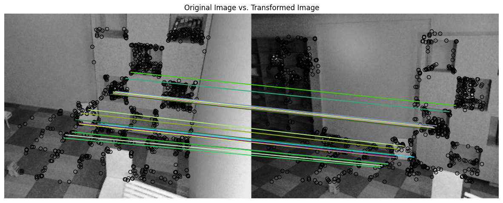
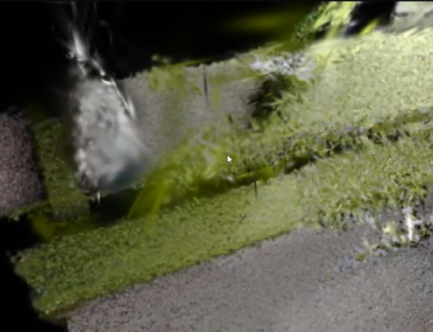
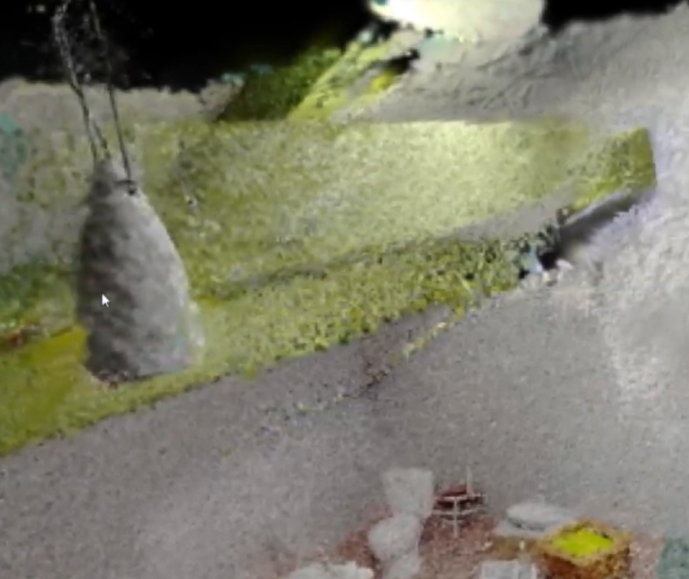

# About
This repository is an extension to the original gaussian splatting reconstruction. Instead of using a precalculated point cloud from COLMAP as input, this repository loads RGBD frames directly and reconstructs the scene

# Datasets
There are 3 additional dataset loaders have been added to this project in addition to default loaders available in orginal respository

### ScanNet
This loads [SanNet](https://github.com/ScanNet/ScanNet) dataset using the **scannet_loaders.py** file

### SceneNet
This loads [SceneNet](https://robotvault.bitbucket.io/scenenet-rgbd.html) which is a synthetic dataset using the **scenenet_loaders.py** file

### Synthetic RGBD
This loads a custom synthetic RGBD dataset using the **rgbd_loaders.py** file

# Synthetic Dataset
Gaussian Splatting uses a OpenCV coordinate system, but the synthetic datasets uses OpenGL based coordinate system. so to load them we need to flip the Y and Z axes before converting to global coordinate system.

### Data Loading Pipeline
$$
camera2world = pose
$$

<br>

$$
GlobalPoints = (camera2world) . (flipYZ) . (CameraPoints)
$$

<br>

$$
CameraPoints = (flipYZ) . (world2camera) . (GlobalPoints)
$$

# Reconstruction
Scene reconstruction from RGBD frames is done in three steps

## Points Fusion
For every K frames this step adds new point to the scene from the current camera point of view based on the following conditions

#### Visibility
- If the current pixel has visibility value less than visibility threshold (0.5)
```
visibility_mask = (rendered_visibility_map < visibility_threshold)
```

#### Raster Depth
- For each pixel, if the absolute distance between the current rendered scene depth map and the new frame depth map is greater than depth_threshold (0.2) and it is closer to camera than existing structure then it represents a new structure in scene in front of an already reconstructed surface area

```
depth_mask = (torch.abs(rendered_depth_map - current_depth_map) > depth_threshold) & (frame_depth_map < rendered_depth_map)
```

Finally the mask in image space where new points are added from new frame based on
```
mask = visibility_mask | depth_mask
```

The newly added gaussian points are initialized based on original work

### Feature Initialization
**Colors** - RGB values from each pixel is converted to SH coefficients

**Point positions** - Obtained from converting the points from RGBD frame to 
global coordinate systen

**Scaling** -  Initialized based on the logarithm of the square root of the distances (dist2) between the points. Simple-KNN package is used to fine K nearest points for each point

**Rotation** -  Initialized with all zeros except for the first column, where all values are set to 1

**Opacity** -  Initialized using the inverse sigmoid function with a constant value.

## Feature Tuning
This step fine tunes the features of newly added point around the scene where they have been added using differentiable gaussian splatting

The model renders the K-2 to K frames and update the point features for N Iterations

### Losses

**RGB Color Loss**

This is a linear combination of RGB L1 loss and SSIM Loss
```
rgb_loss = (1.0 - opt.lambda_dssim) * Ll1 + opt.lambda_dssim * (1.0 - ssim(image, gt_image))
```

**Depth Loss**

Mean absolute difference between Ground Truth depth from RGBD frame and the 
```
invalid_depth_mask = (depth_map == 0)
depth_error = torch.abs(depth_map - viewpoint_cam.original_depth)
depth_loss = (depth_error * ~invalid_depth_mask).mean()
```

**Total Loss**
```
Loss = rgb_loss + depth_loss
```

## Densification
This steps performs the densify and prune of all the Gaussians in the scene


# Keyframe Detection
A keyframe frame detection method has been added. The current implementation follows
#### Feature Matching
- ORB features are detected for each frame and shannon_entropy is calculated
- When ORB feature matching for the current frame to the previous frame drop below a threshold the frame qualifies as a key frame

#### Frame Entropy
- Shannon entropy for the current frame is calculated
- When the entropy change between adjacent frames is above a certain threshold the new frame adds new information to the scene thus the current frame qualifies as a keyframe



# Future Work
## Loss Function
- RGB loss uses a linear combination of L1 and SSIM loss, similar to that we could also add depth loss with a hyperparamater to control the contribution of depth to total loss during the optimization


## Feature Initialization
- When new points are added to the global point cloud they will be initialized based on default initialization method but the points which are already in the scene are optimized and exhibit different behaviour (Points have much larger radius/covariance to represent the surface of an object)
- A new technique where the newly added points are better initialized can be used for quicker optimization


## Age paramater
- A new age feature has been added to the gaussian points which holds the frame_id in which the point has been created from. This feature could be used effectively for better scene or keyframe detection methods.
- The current implmentation also returns a age_map which returns the average age of a pixel which is the average age of all the gaussians which has contributed to the current pixel color
- This feature is not yet added for model checkpoint saving and loading methods


# Results

## Depth Threshold based points Fusion
The following is the results from Scenenet scene 0 reconstruction with and without depth threshold based points addition to the scene. This show when the camera sees a new structure infront of existing structure how the new methods add relevant points for quicker optimizaion. Both have been trained for 150 iteration per frame.

### Without Depth Threshold method


### With Depth Threshold method

